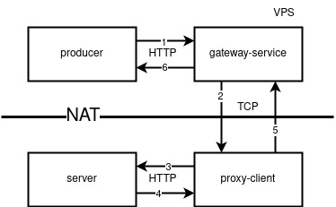
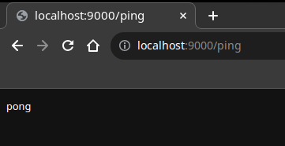

# client-reverse-proxy

This program allows you to accept requests and send responses to the server that is located behind the NAT. This is made possible by a one-time connection of the `proxy-client` to the destination `server` and to the `gateway-server`. The Gateway server must have an `external IP` address and be located, for example, on a rented VPS. The `client-reverse-proxy` program can help in cases where there is no trust in the VPS server, and therefore to the storage of private keys, user database, etc.

## How it works

> [!WARNING]
> This program is written in order to provide an understanding of how reverse-proxy can be implemented using the client side. Therefore, in this example, there is no authorization of the client to the gateway service, which, nevertheless, is a VERY important criterion on the security side.

<p align="center"></p>

1. `tcp connection`: client -> gateway
2. `http request`: producer -> [gateway -> client] -> server
3. `http response`: server -> [client -> gateway] -> producer

This work scenario has a limitation in the need to constantly generate connections from the proxy-client side. If there are not enough connections to successfully maintain communication, then manufacturers will receive errors from the gateway service.

## Example

```bash
$ make
```

```
gateway-1    | gateway is listening...
server-1     | server is listening...
client-2     | client is listening...
client-1     | client is listening...
server-1     | [192.168.48.3:47488]: ping
producer-10  | pong
server-1     | [192.168.48.3:47488]: ping
producer-10  | pong
server-1     | [192.168.48.3:47488]: ping
producer-10  | pong
...
```

You can also open browser page on `http://localhost:9000/ping`.

<p align="center"></p>

### Docker-Compose

```yaml
version: "3"
services:
  producer:
    build:
      context: ./
      dockerfile: cmd/producer/Dockerfile
    depends_on:
      - client
    deploy:
      mode: replicated
      replicas: 1
    networks:
      - producer-gateway
  gateway:
    build:
      context: ./
      dockerfile: cmd/gateway/Dockerfile
    ports:
      - 9000:9000
    networks:
      - producer-gateway      
      - gateway-client
  client:
    build:
      context: ./
      dockerfile: cmd/client/Dockerfile
    depends_on:
      - server
      - gateway
    deploy:
      mode: replicated
      replicas: 2
    networks:
      - gateway-client
      - client-server
  server:
    build:
      context: ./
      dockerfile: cmd/server/Dockerfile
    depends_on:
      - gateway
    networks:
      - client-server
networks:
  gateway-client:
    driver: bridge
  producer-gateway:
    driver: bridge
  client-server:
    driver: bridge
```
